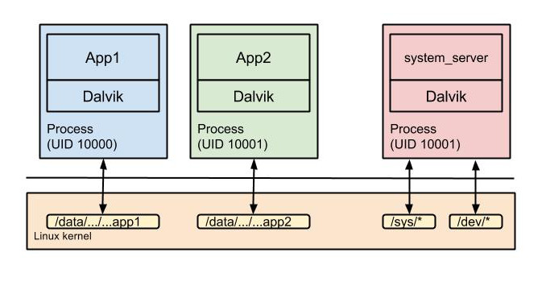
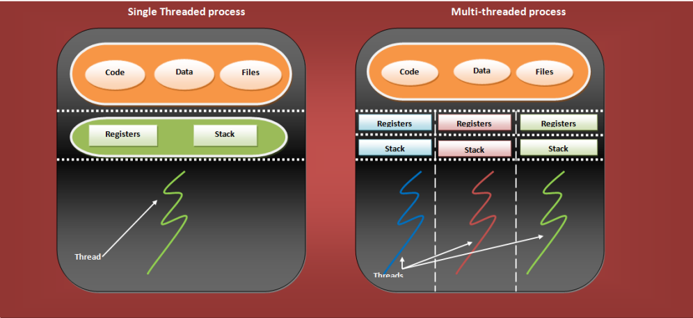
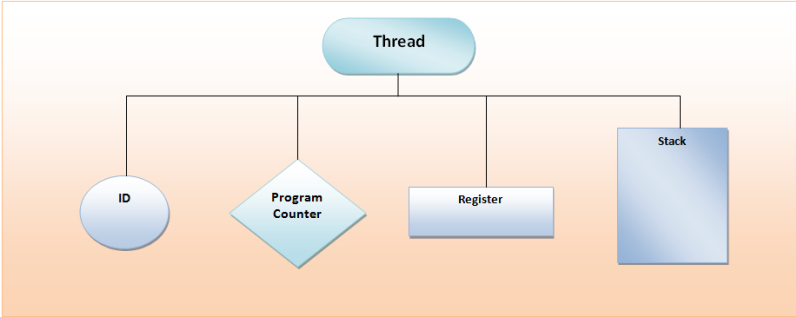

## Yandex Practicum
# Multithreading

---

### Процессы




```agsl
<activity
    ...
    android:process="my.process1"
/>

<activity
    ...
    android:process="my.process2"
/>
```

---

### Потоки






```agsl
//java

public void synchronized myFun() {
...
}

private Object lock = new Object();

public void myFun2() {
    synchronized(lock) {
    ...
    }
}

public static synchronized myFun3() {
...
}
```

```agsl
//kotlin
val lock = Object()
@Synchronized
fun fun1() {
  synchronized(lock) {
    
  }
}
```

```
List<Integer> syncList = Collections.synchronizedList(new ArrayList<>());

Map<Integer, String> syncMap = Collections.synchronizedMap(new HashMap<>());

ConcurrentMap<String, String> map = new ConcurrentHashMap<>();

BlockingQueue

AtomicInteger atomicInt = new AtomicInteger(0);

ExecutorService executor = Executors.newFixedThreadPool(2);
executor.execute(new Runnable() {...})

```
