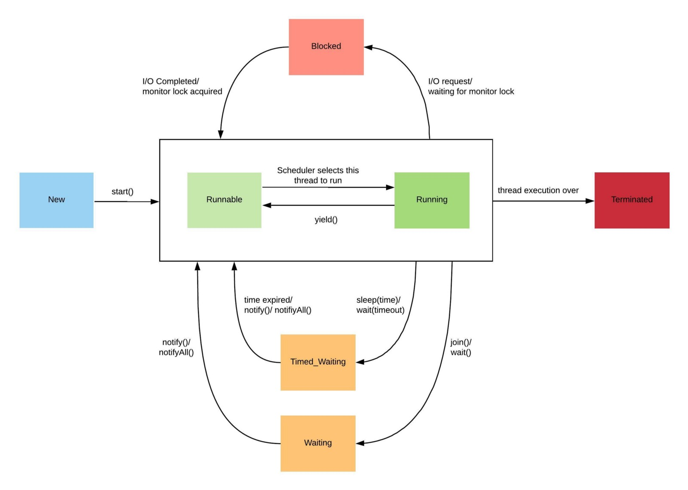

## Yandex Practicum
# Multithreading

---

### Процессы


```agsl
<activity
    ...
    android:process="my.process1"
/>

<activity
    ...
    android:process="my.process2"
/>
```

---

### Потоки


---

```java
//java

public void synchronized myFun() {
...
}

private Object lock = new Object();

public void myFun2() {
    synchronized(lock) {
    }
}

public static synchronized myFun3() {
}
```

```kotlin
//kotlin
val lock = Object()
@Synchronized
fun myFun() {
}

fun myFun2() {
  synchronized(lock) {
  }
}

companion object {
  @Synchronized
  fun myFun3() {
  }
}


```

```
List<Integer> syncList = Collections.synchronizedList(new ArrayList<>());

Map<Integer, String> syncMap = Collections.synchronizedMap(new HashMap<>());

ConcurrentMap<String, String> map = new ConcurrentHashMap<>();

BlockingQueue

AtomicInteger atomicInt = new AtomicInteger(0);

ExecutorService executor = Executors.newFixedThreadPool(2);

```
